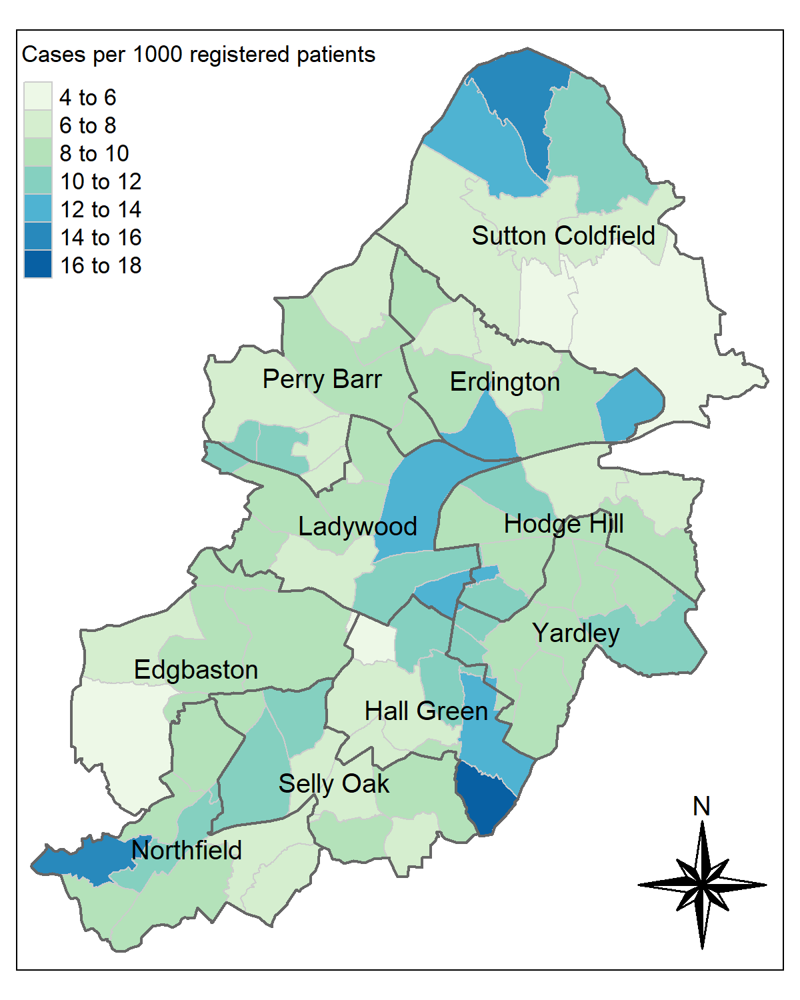
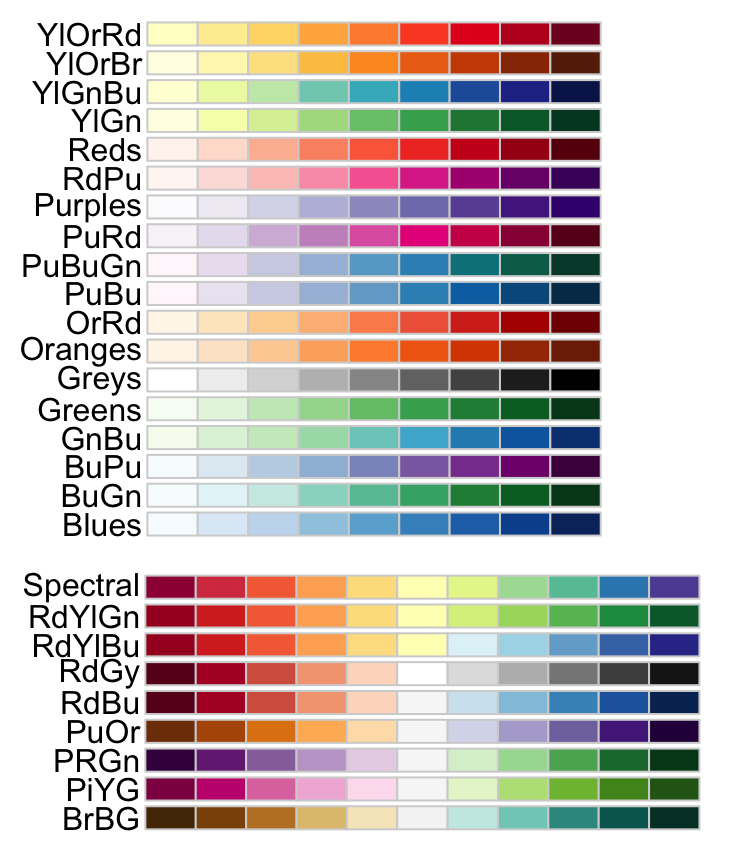

GP-Mapper
================
David Ellis
Last Updated: 2023-04-25

## Introduction

### What is `GP-Mapper`?

Within Public Health we often work a lot with data where we have a
number for each GP. However, it can be difficult to draw out any wider
geographical trends from these single data points. We therefore often
want to convert this GP-level data into ward, constituency or
locality-level data. This data is then much easier to visualise as a
choropleth map (often called a heat map).

`GP-mapper` is an R module designed to automatically convert GP-level
counts to a ward, constituency or locality level, and produce
customisable choropleth maps, such as that shown below. We can show
numbers in both their raw and normalised form (for example total number
of cases vs. cases per 1000 registered patients).

<div class="figure" style="text-align: center">


<p class="caption">
GP-mapper example using randomly generated data
</p>

</div>

## `GP-Mapper` basics

### Loading GP-mapper

All of the code and geometries are stored on the shared drive
`publichealth$`. To load the module, all you have to do is tell R where
to find it. This is done using `source()` as follows.

``` r
source("GP-mapper.R")
```

### Aggregating data

Next, we need some GP-level data, for example from
[FingerTips](https://fingertips.phe.org.uk/). As a minimum, the data
must have a column containing the GP practice codes and the values you
want to aggregate as shown in the example below. Don’t worry if you have
additional columns. We will tell the GP-mapper which columns we want to
use and any others will be ignored.

<div class="figure" style="text-align: center">


<p class="caption">
Example data set of the number of ‘Cases’ for each GP. This data is
randomly generated and does not reflect any real data.
</p>

</div>

We aggregate this data using the function `convert_GP_data()`. At a
minimum, this function takes:

1.  `file`: The path to your GP-level data or your preloaded dataframe
2.  `GP_code_header`: The name of the GP code column (Here it’s
    `"Practice Code"`)
3.  `value_header`: The value you want to aggregate (Here it’s
    `"Cases"`)

Our code now looks like this:

``` r
source("GP-mapper.R")

data <- convert_GP_data(
  file = "example_data.xlsx",
  GP_code_header = "Practice Code",
  value_header = "Cases"
)
```

You can run this code by either highlighting the code and clicking `Run`
or by pressing `Ctrl` + `Alt` + `R`.

`GP-mapper` will automatically download any missing prerequisite
libraries so this may take a few minutes the first time running it on
your machine.

As a default, `convert_GP_data()` will load the first sheet of the
provided excel spreadsheet and convert our GP data to a ward-level.

We can load different sheets by providing another variable `sheets`
either to the sheet name or number. Additionally, we can change the
aggregation level by setting `to` equal to `"Constituency"` or
`"Locality"`. Both of these are shown in the example below.

``` r
source("GP-mapper.R")

data <- convert_GP_data(
  file = "example_data.xlsx",
  GP_code_header = "Practice Code",
  value_header = "Cases",
  sheet = "GP data",
  to = "Locality"
)
```

We will cover how to include a normalising value, such as population
size, later.

### Saving the data

To save this data, for example, if you want to present it in PowerBI
instead of plotting it in R, we use `save_data()` function.

This takes:

1.  `data`: the outputted data from `convert_GP_data()`
2.  `save_path`: path to where the data should be saved (default =
    `"map_data.xlsx"`)

Note that the file extension must be either `".xlsx"` or `".csv"`.

We can then add the following to the bottom of our example code and run
as before:

``` r
save_data(
    data,
    save_path = "my_ward_data.xlsx"
) 
```

Notice that if we open this new file we will see that the aggregated
values have the same column header as before.

### Plotting choropleth map

Finally, we can plot this data as a map using `plot_map()`. The function
takes:

1.  `data`: the outputted data from `convert_GP_data()`
2.  `value_header`: the name of the data column to be plotted (here:
    `"Cases"`)
3.  `map_type`: Set to `"Ward"`, `"Constituency"` or `"Locality"`
    (Default = `"Ward"`)
4.  `save_name`: Path to save the map to (Default = `"new_map.png"`)

Therefore, we can generate a basic map by running:

``` r
  plot_map(
    data,
    value_header = "Cases",
    map_type = "Ward",
    save_name = "my_ward_map.png"
    )
```

This produces a map that looks like this:

<div class="figure" style="text-align: center">


<p class="caption">
Example of a basic map produced by `GP-mapper` from randomly generated
data.
</p>

</div>

There are some ways that we can customise this map that we will cover
later.

## Normalising Data

### Why normalise?

Different wards can have very different population sizes. For example,
the 2011 census recorded that the Ladywood ward had 22,259 residents
while Lozells had only 9153. Therefore, it is often inappropriate to
compare the raw numbers of cases/conditions between different areas.

We may instead want to normalise the counts by the size of the relevant
population. This will often be the total number of residents, however,
at times we might find it more appropriate to use a more specific
reference population. For example, if we’re investigating the rates of
teenage pregnancy it would probably be best to look at the number of
cases per X the number of teenage girls.

### Normalising with `GP-mapper`

Fortunately, normalising data with `GP-mapper` is easy. All we have to
do is add a new argument `norm_header` to `convert_GP_data()` with the
name of the column variable that contains our denominator.

As a default, `convert_GP_data()` will calculate the normalised number
as a percentage, i.e. $100*value/norm$ or the number of cases *per 100*
of the reference population. To change this we can set the
`norm_output_per` value. For example, if we wanted the count per 1000 of
the population we would set `norm_output_per = 1000` as shown in the
example below.

``` r
source("GP-mapper.R")

data <- convert_GP_data(
  file = "example_data.xlsx",
  GP_code_header = "Practice Code",
  value_header = "Cases",
  norm_header = "Registered Patients",
  norm_output_per = 1000
)
```

If we save this data using `save_data()` we see that the new column name
is a combination of our `value_header`, `norm_output_per` and
`norm_header`. Specifically it’s “`value_header` per `norm_output_per`
`norm_header`”

This is important since we need to know the column header to plot the
normalised data. You can also check the column names by running
`colnames(data)` or simply saving the data and opening the data excel.

### Plotting normalised data

Plotting the data works the same as before except we give `plot_map()`
our new column header. In the case of the example above, our code would
look as follows:

``` r
  plot_map(
    data,
    value_header = "Cases per 1000 Registered Patients",
    map_type = "Ward",
    save_name = "my_ward_map.png"
    )
```

## Customising your map

### Map title

We can give our map a title by simply providing `map_title` argument. If
your title is long, the text will not automatically wrap to the next
line. Therefore, you may have to include one or more new-line characters
(`"\n"`) to force the text to start a new line, such as in the example
below.

``` r
  plot_map(
    data,
    value_header = "Cases per 1000 children",
    map_type = "Ward",
    save_name = "fairy_map.png",
    map_title = "Number of tooth-fairy visits\nper 1000 children"
    )
```

<div class="figure" style="text-align: center">


<p class="caption">
Example of multi-line title produced by `GP-mapper` from randomly
generated data.
</p>

</div>

### Colour pallet

We can also change the colour pallet by setting the `pallet` argument.
The default is set to `"Blues"` but there are many other colour pallets
pre-programmed into R including those shown below. You can find more
information about R’s colour pallets
[here](https://www.datanovia.com/en/blog/top-r-color-palettes-to-know-for-great-data-visualization/).

<div class="figure" style="text-align: center">


<p class="caption">
Some of the sequential (top) and diverging (bottom) colour maps that are
preprogrammed into R. Source:
[DataNovia](https://www.datanovia.com/en/blog/top-r-color-palettes-to-know-for-great-data-visualization/).
</p>

</div>

When choosing a colour map, it is worth taking some time to consider
accessibility for colour-blind readers. It is best practice to choose a
perceptually uniform colour pallet whenever possible. Additionally, if
your map includes constituency or locality names, it might be worth
using an [online contrast
checker](https://webaim.org/resources/contrastchecker/?fcolor=0000FF&bcolor=FFFFFF)
to determine how easy the text is to read.

``` r
plot_map(
  data = agg_data,
  value_header = "Cases per 1000 Villa fans",
  save_name = "zombie_map.png",
  map_type = "Constituency",
  map_title = "Number of zombie outbreaks\nper 1000 Villa fans",
  pallet = "RdPu"
)
```

<div class="figure" style="text-align: center">


<p class="caption">
Example of a constituency-level map with a title and custom colour
pallet produced by `GP-mapper` from randomly generated data.
</p>

</div>

### Area names and boundaries

As can be seen from the examples above, for ward-level maps `GP-mapper`
defaults to showing constituency lines and names. These can be turned
off by setting `const_lines` and `const_names` both to `FALSE`. For
example:

``` r
plot_map(
  data = agg_data,
  value_header = "Cases",
  save_name = "no_lines.png",
  map_type = "Ward",
  const_lines = FALSE,
  const_names = FALSE
)
```

<div class="figure" style="text-align: center">


<p class="caption">
Example of a ward-level map with constituency boundaries and names
switched off produced by `GP-mapper` from randomly generated data.
</p>

</div>

We can also choose to turn on locality boundaries and names by setting
`locality_lines` and `locality_names` both equal to `TRUE`. For example:

``` r
plot_map(
  data = agg_data,
  value_header = "Cases",
  save_name = "no_lines.png",
  map_type = "Ward",
  locality_lines = TRUE,
  locality_names = TRUE
)
```

<div class="figure" style="text-align: center">


<p class="caption">
Example of a ward-level map with locality boundaries and names switched
on. Produced by `GP-mapper` from randomly generated data.
</p>

</div>

Notice that in the example above that turning on the locality boundaries
automatically turned off the constituency boundaries.

### Compass

Finally, you can turn off the automatic compass in the bottom right-hand
corner by setting `compass = FALSE` as shown below.

``` r
plot_map(
  data = agg_data,
  value_header = "Cases",
  save_name = "no_compass.png",
  map_type = "Ward",
  map_title = "Number lost people per 1000\npeople without a compass",
  compass = FALSE
)
```

<div class="figure" style="text-align: center">


<p class="caption">
Example of a ward-level with the compass turned off. Produced by
`GP-mapper` from randomly generated data.
</p>

</div>
