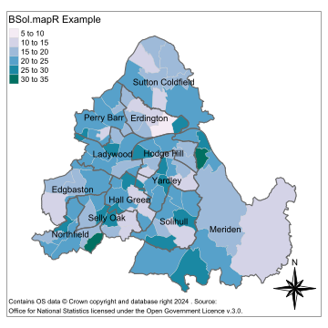
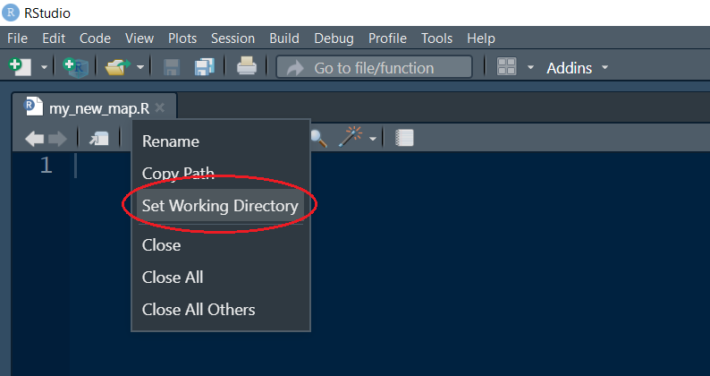
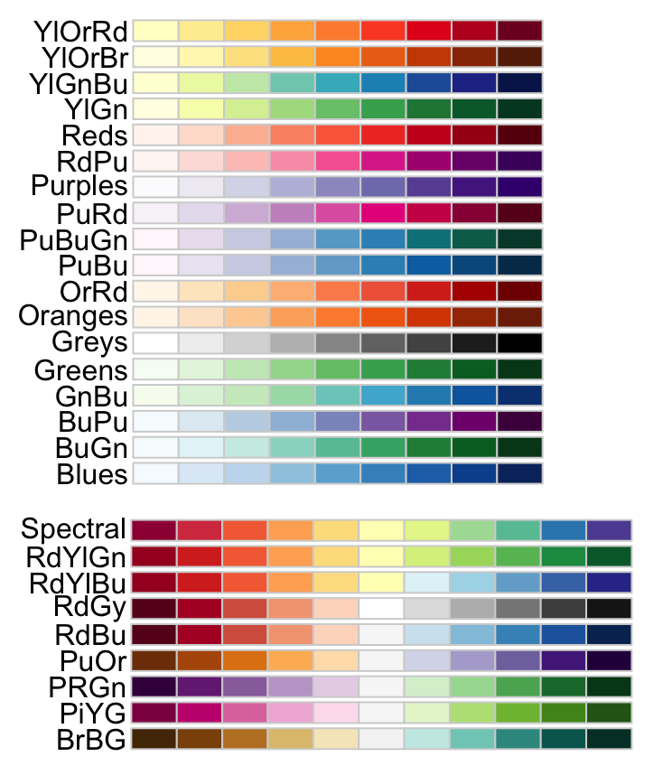
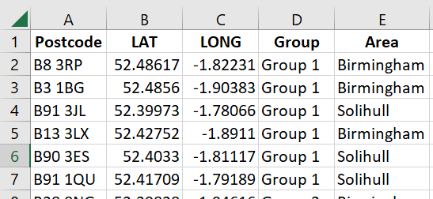
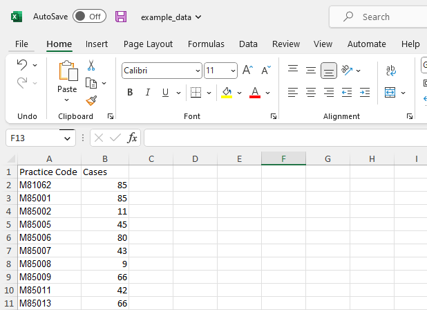

# BSol.mapR

GitHub: [BSol.mapR](https://github.com/David-Ellis/BSol.mapR)

David Ellis - BCC PHM

Late Updated: 2024-01-10
 
## Introduction

### What is BSol.mapR?

BSol.mapR is an R package designed to make plotting heat maps for Birmingham and Solihull such as the one below as easy as possible. The package supports all major geographies from LSOA to Locality and includes code for estimating Ward, Constituency and Locality values from GP-level data.

<div class="figure" style="text-align: center">


<p class="caption">
BSol.mapR example using randomly generated data
</p>

</div>

## BSol.mapR basics

### Installing BSol.mapR

The package is used in the same way as any other R package you might be familiar with. However, the installation uses a slightly different function. We can install the package directly from GitHub by typing the following command into the RStudio console:

``` r
devtools::install_github("David-Ellis/BSol.mapR")
```

`BSol.mapR` will automatically download any missing prerequisite
libraries so this may take a few minutes the first time running it on
your machine.

### Loading BSol.mapR

Once installed, you can open a new file by clicking the icon in the top left corner of RStudio underneath "file". In this new script, you can load the library at the start of a new R script using the following function. 

``` r
library("BSol.mapR")
```

You can run this code by either highlighting the code and clicking `Run`
or by pressing `Ctrl` + `Alt` + `R`.

### Setting your working directory

Before we get R to find any data, we need to tell it where to start looking from. Save your new script somewhere, and tell R to make this place your <i>working directory</i> by right-clicking the tab with your script name as shown below:

<div class="figure" style="text-align: center">


<p class="caption">
Setting your working directory.
</p>

</div>

### Loading data

To load data from Excel, we normally have to install and load additional R packages. However, BSol.mapR is set up to deal with this automatically. We can load xlsx, xls, and csv files using the `load_data_file()`. The function function takes the following arguments:

1.  `file_path`:  path to the data file you want to load
2.  `sheet`: (Optional) The name or number of the Excel tab containing (default = `1`)


An example of how this function is used is shown below.

``` r
data <- load_data_file(
  "data/my_data.xlsx",
  sheet = "data"
  )
```

Your data must start in the top left-hand corner of the spreadsheet (cell A1). Any titles or empty cells above the data table will confuse R and prevent it from loading your data correctly.

### Plotting a heat map

Finally, we can plot this data as a map using `plot_map()`. The function takes
the following basic arguments:

1.  `data`: data frame output from `load_data_file()` or `convert_GP_data()`
2.  `value_header`: the name of the data column to be plotted (here:
    `"Cases"`)
3.  `map_type`: Geography type to be plotted. Can be any of the following: "Ward", "Constituency", "Postal District", "Postal Sector", "LSOA11", "MSOA11", "LSOA21", "MSOA21".
4.  `area_name`: (Optional) The area you want to plot - BSol, Solihull, or Birmingham (Default = `"BSol"`)

Therefore, we can generate a basic map by running:

``` r
  plot_map(
    data,
    value_header = "Cases",
    map_type = "Ward",
    area_name = "Birmingham"
    )
```

This produces a map that looks like this:

<div class="figure" style="text-align: center">


<p class="caption">
Example of a basic map produced by `BSol.mapR` from randomly generated
data.
</p>

</div>

### Saving the map

To save as an image, we have to first store our produced map as a variable. 
This is done using the `<-` operator. We can then give our stored
map to the `save_map()` function as shown below.

Maps can be saved using all major image types including "png" and "jpg". However, it is recommended to a vector formats such as "svg". These formats are still compatible with products such as Microsoft Word and PowerPoint. However, since they are vector images, they maintain their quality at all levels of magnification.

```r
# Plot the map
map <- plot_map(
    data,
    value_header = "Cases",
    map_type = "Ward",
    area_name = "Birmingham"
    )

# save the map
save_map(
    map,
    save_name = "new_map.svg"
)

```

## Customising your map

### Map title

We can give our map a title by simply providing `map_title` argument. If
your title is long, the text will not automatically wrap to the next
line. Therefore, you may have to include one or more new-line characters
(`"\n"`) to force the text to start a new line, such as in the example
below.

``` r
  plot_map(
    data,
    value_header = "Cases per 1000 children",
    area_name = "Solihull"
    map_type = "LSOA21",
    map_title = "Number of tooth-fairy visits\nper 1000 children"
    )
```

<div class="figure" style="text-align: center">


<p class="caption">
Example of multi-line title produced by `BSol.mapR` from randomly
generated data.
</p>

</div>

### Colour palette

We can also change the colour palette by setting the `palette` argument.
The default is set to `"Blues"` but there are many other colour palettes
pre-programmed into R including those shown below. You can find more
information about R’s colour palettes
[here](https://www.datanovia.com/en/blog/top-r-color-palettes-to-know-for-great-data-visualization/).

<div class="figure" style="text-align: center">


<p class="caption">
Some of the sequential (top) and diverging (bottom) colour maps that are
preprogrammed into R. Source:
[DataNovia](https://www.datanovia.com/en/blog/top-r-color-palettes-to-know-for-great-data-visualization/).
</p>

</div>

When choosing a colour map, it is worth taking some time to consider
accessibility for colour-blind readers. It is best practice to choose a
perceptually uniform colour palette whenever possible. Additionally, if
your map includes constituency or locality names, it might be worth
using an [online contrast
checker](https://webaim.org/resources/contrastchecker/?fcolor=0000FF&bcolor=FFFFFF)
to determine how easy the text is to read.

``` r
plot_map(
  data = data,
  value_header = "Cases per 1000 Villa fans",
  map_type = "Constituency",
  map_title = "Number of zombie outbreaks\nper 1000 Villa fans",
  palette= "RdPu"
)
```

<div class="figure" style="text-align: center">


<p class="caption">
Example of a constituency-level map with a title and custom colour
palette produced by `BSol.mapR` from randomly generated data.
</p>

</div>

### Area names and boundaries

As can be seen from the examples above, for ward-level maps `BSol.mapR`
defaults to showing constituency lines and names. These can be turned
off by setting `const_lines` and `const_names` both to `FALSE`. For
example:

``` r
plot_map(
  data = data,
  value_header = "Cases",
  map_type = "MSOA11",
  const_lines = FALSE,
  const_names = FALSE
)
```

<div class="figure" style="text-align: center">


<p class="caption">
Example of a ward-level map with constituency boundaries and names
switched off produced by `BSol.mapR` from randomly generated data.
</p>

</div>

We can also choose to turn on locality boundaries and names by setting
`locality_lines` and `locality_names` both equal to `TRUE`. For example:

``` r
plot_map(
  data = data,
  value_header = "Cases",
  map_type = "Postal District",
  locality_lines = TRUE,
  locality_names = TRUE
)
```

<div class="figure" style="text-align: center">


<p class="caption">
Example of a ward-level map with locality boundaries and names switched
on. Produced by `BSol.mapR` from randomly generated data.
</p>

</div>

Notice that in the example above that turning on the locality boundaries
automatically turned off the constituency boundaries.

### Compass

Finally, you can turn off the automatic compass in the bottom right-hand
corner by setting `compass = FALSE` as shown below.

``` r
plot_map(
  data = data,
  value_header = "Cases",
  map_type = "Ward",
  area_name = "Solihull",
  map_title = "Number lost people per 1000\npeople without a compass",
  palette = "Greens",
  compass = FALSE
)
```

<div class="figure" style="text-align: center">


<p class="caption">
Example of a ward-level with the compass turned off. Produced by
`BSol.mapR` from randomly generated data.
</p>

</div>

## Adding points

BSol.mapR also has the ability to overlay points onto your map using the `add_points()` function. This function takes the following basic arguments:
1.  `map`: Map object returned from plot_map(), plot_empty_map() or add_points()
2.  `points_data`: data frame containing LONG and LAT of each point
3. `color`: point colour (default = `"orange"`). Note: the argument name is spelt  using the <i>American</i> spelling for colour.

We can load our spreadsheet containing the points to be plotted using `load_data_file()` as before. However, this file must contain the column headers `"LONG"` (longitude) and `LAT` (latitude). The data might look something like this:

<div class="figure" style="text-align: center">


</div>

A full example is shown below.

```r
library(BSol.mapR)

# Load data
ward_data <- load_data_file("data/myWardData.csv")
points_data <- load_data_file("data/myPointsData.csv")

# plot base map
map <- plot_map(
  data = data,
  value_header = "Cases",
  map_type = "LSOA11"
)

# add points
map <- add_points(
  map,
  points_data
)

# Save as vector image
save_map(map, "map-with-points.svg")
```

<div class="figure" style="text-align: center">


<p class="caption">
Example of an LSOA-level map with geographical locations plotted on top. Produced by `BSol.mapR` from randomly generated data.
</p>

</div>

### Groups of objects on an empty map

Sometimes we will want to plot the locations of things on top of an empty map rather than a heat map. For this, we can use the function `plot_empty_map()`. This function takes all the same arguments as `plot_map()` except those relating to data.

Additionally, we can colour code the points based on some group to which they belong. In the example data above, we see that each point has a group number under the column "Group". We can tell the `add_points()` function to colour the points based on these groups by setting `color = "Group"`.

Both of these features are presented in the example below.

```r
library(BSol.mapR)

# Load data
points_data <- load_data_file("data/myPointsData.csv")

# plot base map
map <- plot_empty_map(
  map_type = "Locality"
)

# Add points with groups
map <- add_points(
  map,
  points_data,
  color = "Group"
)

# Save as vector image
save_map(map, "grouped-points.svg")
```

<div class="figure" style="text-align: center">


<p class="caption">
Example of an empty BSol map with grouped geographical locations plotted on top. Produced by `BSol.mapR` from randomly generated data.
</p>

</div>

## Converting GP data

Within Public Health we often work a lot with data where we have a
number for each GP. However, it can be difficult to draw out any wider
geographical trends from these single data points. We therefore often
want to convert this GP-level data into ward, constituency or
locality-level data. This data is then much easier to visualise as a
choropleth map (often called a heat map).

`BSol.mapR` is an R module designed to automatically convert GP-level
counts to a ward, constituency or locality level, and produce
customisable choropleth maps, such as that shown below. We can show
numbers in both their raw and normalised form (for example total number
of cases vs. cases per 1000 registered patients).

Next, we need some GP-level data, for example from
[FingerTips](https://fingertips.phe.org.uk/). As a minimum, the data
must have a column containing the GP practice codes and the values you
want to aggregate as shown in the example below. Don’t worry if you have
additional columns. We will tell the BSol.mapR which columns we want to
use and any others will be ignored.

<div class="figure" style="text-align: center">




</div>

We aggregate this data using the function `convert_GP_data()`. At a
minimum, this function takes:

1.  `data`: Data frame output from `load_data_file()`
2.  `GP_code_header`: The name of the GP code column (Here it’s
    `"Practice Code"`)
3.  `value_header`: The value you want to aggregate (Here it’s
    `"Cases"`)

Our code now looks like this:

``` r
library("BSol.mapR.R")

raw_data <- load_data_file(
  "data/fingertips_data.csv"
)

ward_data <- convert_GP_data(
  data = raw_data,
  GP_code_header = "Practice Code",
  value_header = "Cases"
)
```

As a default, `convert_GP_data()` will convert our GP data to a ward-level.

We can change the aggregation level by setting `to` equal to `"Constituency"` or `"Locality"`. An example of converting to a locality level is shown below.

``` r
library("BSol.mapR.R")

raw_data <- load_data_file(
  "data/fingertips_data.csv"
)

Locality_data <- convert_GP_data(
  data <- raw_data,
  GP_code_header = "Practice Code",
  value_header = "Cases",
  sheet = "GP data",
  to = "Locality"
)
```

### Saving the data

To save this data, for example, if you want to present it in PowerBI
instead of plotting it in R, we use `save_data()` function.

This takes:

1.  `data`: the outputted data from `convert_GP_data()`
2.  `save_path`: path to where the data should be saved (default =
    `"map_data.xlsx"`)

Note that the file extension must be either `".xlsx"`,`".xls"` or `".csv"`.

We can then add the following to the bottom of our example code and run
as before:

``` r
save_data_file(
    data,
    save_path = "my_ward_data.xlsx"
) 
```

Notice that if we open this new file we will see that the aggregated
values have the same column header as before.
## Normalising Data

### Why Normalise? 

Different wards can have very different population sizes. For example, the 2011 census recorded that the Ladywood ward had 22,259 residents while Lozells had only 9153. Therefore, it is often inappropriate to compare the raw numbers of cases/conditions between different areas.

We may instead want to normalise the counts by the size of the relevant
population. This will often be the total number of residents, however,
at times we might find it more appropriate to use a more specific
reference population. For example, if we’re investigating the rates of
teenage pregnancy it would probably be best to look at the number of
cases per X the number of teenage girls.


### Normalising with `BSol.mapR`

Fortunately, normalising data with `BSol.mapR` is easy. All we have to
do is add a new argument `norm_header` to `convert_GP_data()` with the
name of the column variable that contains our denominator.

As a default, `convert_GP_data()` will calculate the normalised number
as a percentage, i.e. $100*value/norm$ or the number of cases *per 100*
of the reference population. To change this we can set the
`norm_output_per` value. For example, if we wanted the count per 1000 of
the population we would set `norm_output_per = 1000` as shown in the
example below.

``` r
library("BSol.mapR.R")

data_to_normalise <- load_data_file(
  "data/more_GP_data.csv"
)

data <- convert_GP_data(
  data = data_to_normalise,
  GP_code_header = "Practice Code",
  value_header = "Cases",
  norm_header = "Registered Patients",
  norm_output_per = 1000
)
```

If we save this data using `save_data_file()` we see that the new column name
is a combination of our `value_header`, `norm_output_per` and
`norm_header`. Specifically it’s “`value_header` per `norm_output_per`
`norm_header`”

This is important since we need to know the column header to plot the
normalised data. You can also check the column names by running
`colnames(data)` or simply saving the data using `save_data_file()` and opening the data in Excel.

### Plotting normalised data

Plotting the data works the same as before except we give `plot_map()`
our new column header. In the case of the example above, our code would
look as follows:

``` r
  plot_map(
    data,
    value_header = "Cases per 1000 Registered Patients",
    map_type = "Ward"
    )
```

